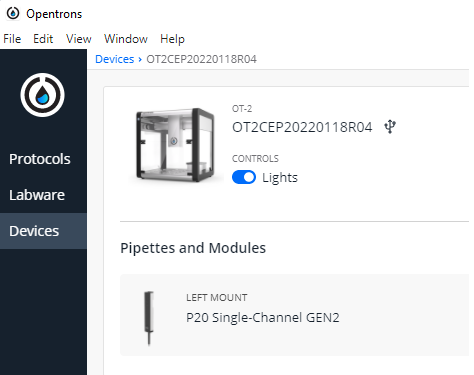
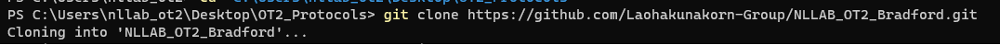
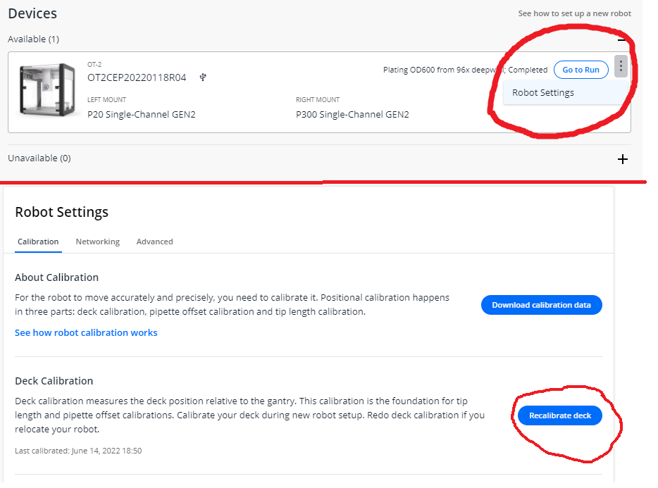
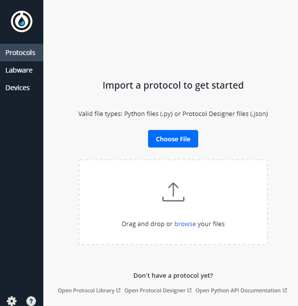
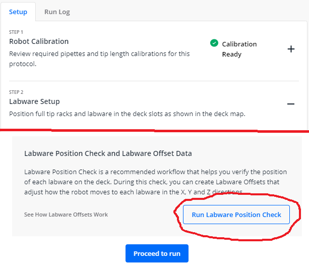
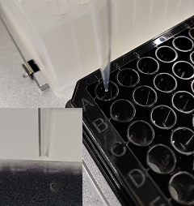

# OT2 Bradford Assay

## Introduction:

This protocol uses the OT2 to conduct a Bradford Assay on a sample of protein of unknown concentration.

Rough outline of steps:

### Opentrons:

 1. Prepares a series of dilutions from protein sample.

 2. Dispenses 300ul of Bradford Reagent

 3. Plates 10ul of the dilutions a 96 well plate with serial dilutions of BSA standard.


### Plate shaker  
Mixes the solutions in the wells: *1000rpm at 21 degrees for 10 mins*


### Plate Reader:

Conducts a final orbital shake and reads the absorbance in the selected wells.

###  Analysis Package:

 1. First script parses, trims, cleans and organises the raw data

 2. Second performs the bayesian linear regression and produces metrics on the posteriors

 3. Third conducts the predictions and corrects for dilution.


## Materials:

First, turn on the OT2 and login to the computer. Please ask a lab member for the password.

Next, open the OT2 Software and make sure it is connected to the OT2.
You can confirm this by turning the lights on.



See if the protocol already exists by opening the **OT2_Protocols** folder on the desktop.  
You should see NLLAB_OT2_Bradford, if it's not there then follow the instructions in the **Downloads** section below. If it is there then skip to **The Files**.

### Download

Download the repository by opening a terminal or command line, navigating to your desired folder on your local machine or the OT2 machine.  
Use the Change Directory command. An example is given below but use your folder of choice:

e.g.
```bash
cd Desktop/OT2_Protocols
```

If you're successful, you'll see something like this:


Next you need to download the repository using the git clone command ***if it's not there already***:

```bash
git clone https://github.com/aperkins19/NLLAB_OT2_Bradford
```
If you're successful, you'll see something like this:




### Files:

 * *trevor_6_tuberack_5000ul.json*
  * This contains the dimensions for the falcon tube rack and must be uploaded to the labware section in the opentrons app **if it is not there already.**


 * *bradford_plating_ot2_script.py*
  * This is the script/"protocol" that the opentrons actually runs.


## Setting up the OT2

I *highly recommend* performing a deck calibration before you go any further. The OT2 is fickle creature and you don't want to mess up your samples with a crash.  
You can do this by clicking here and following the instructions. **Be sure to do it as accurately as you can**:  



**Next, you need to upload the OT2 script. Go to the Protocols tab and select** *Choose File*, **then select** *bradford_plating_ot2_script.py*.




### Rack Set-Up:

**Now place the labware securely into the OT2 using the diagram below.**


**Your deck should look like this. Make sure everything is secure!**

#### Position 4 (Protein sample + Standards source):

* Standards Dilutions - Each 2ml Eppendorf contains 100ul of standard.
 * 0ug/ml in A1 - 1000ug/ml in D1 - 1250ug/ml in A2 - 2000ug/ml in D2.

* Put 100ul of the manually diluted sample dilution 10X in A6. ***This should be prepared with 90ul of Stock-30 mixed with 10ul of your protein sample***

#### Position 8 (Source for Stock-30 & Bradford Reagent):

* A1 - 10ml of stock-30 in a 50ml Falcon

* A2 - 22.5ml of Bradford Reagent in a 50ml Falcon.

* B1 - Empty 50ml Falcon - *this just acts as a bin for residual liquids.*


#### Position 6 (Where the OT2 performs the sample dilutions):

* Fill columns 1&2 with empty 2ml eppendorfs.


**Now select "Run Protocol", Select the OT2 and "Proceed to setup" at the bottom.**

Hopefully you will have a "Calibration Ready" next to Robot Calibration. **This is solely for the Deck**, keep scrolling down until you find *Run Labware Position Check*.  
Select it and follow the instructions. **This is very important.**



#### Calibration Offset Check

You will probably have to adjust the labware offsets. Do this by selecting **Reveal Jog Controls**.
Make sure that what you're positioning is centered exactly over the centre of what you're positioning it over.  
In terms of height (Z axis) you want the pipette tip to be *just* above the top of the well or tube. The gap should be with in 0.1mm, so a tiny slither of light. Having said that, it's better to have it slightly too high than too low. Even though the labware is supposed to be made to very high spec, warping and tiny deviations can been that, for example: At the bottom of well A1, the tip is 0.1mm above the bottom of the well but at the bottom of G7, the tip might touch the bottom. This means that the tip will not aspirate/dispense leading to a build up in pressure which is released when the tip moves up again. This leads to greatly increased technical error and possibly your sample being flung across the robot.  
So do this carefully and err on the side of caution.  
The picture below illustrates what you're after.




## Run

### Dilutions:


### Plating up:
The OT2 will aliquot 300ul of Bradford reagent into the wells and follow up with 10ul of respective samples. Each one is plated in triplicate.

#### Resulting Plate


## Quantification

### Taking the reading:

1. **Take a reading immediately:** Use the *NLLAB_OT2_Automated_Bradford_H1_protocol.ext* protocol on the H1 plate-reader. **If it's not there, the file can be found in the */analysis* directory.**

2. Place the finished plate on to the plate shaker and shake at 1000rpm for 10 mins at room temperature.

3. Take a second reading.

### Exporting the data:

Whelp.

## Data Analysis

You have two options: bayesian and frequentist linear regression. Download the appropriate zip file and follow the readme. You can find both in the */analysis* directory.
