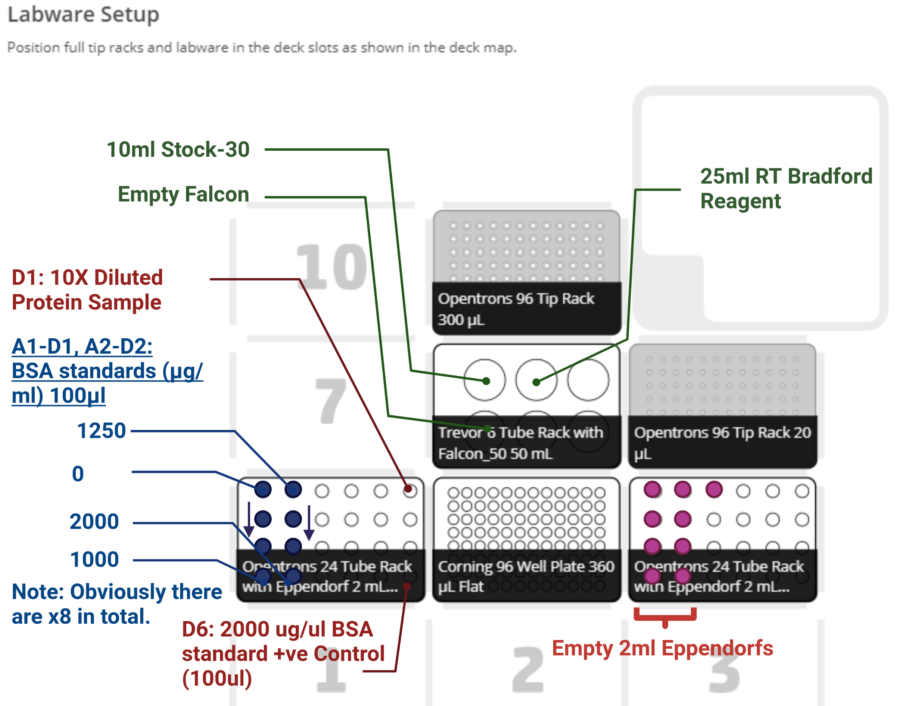

# OT2 Bradford Assay

## Introduction:

This protocol uses the OT2 to conduct a Bradford Assay on a sample of protein of unknown concentration.

Rough outline of steps:

### Opentrons:

 1. Prepares a series of dilutions from protein sample.

 2. Dispenses 300ul of Bradford Reagent

 3. Plates 10ul of the dilutions a 96 well plate with serial dilutions of BSA standard.

### Plate shaker  
Mixes the solutions in the wells: *1000rpm at 21 degrees for 10 mins*

### Plate Reader:

Conducts a final orbital shake and reads the absorbance in the selected wells.

###  Analysis Package:

 1. First script parses, trims, cleans and organises the raw data

 2. Second performs the bayesian linear regression and produces metrics on the posteriors

 3. Third conducts the predictions and corrects for dilution.

## Opentrons setup:

 Files:

 * *trevor_6_tuberack_5000ul.json*
  * This contains the dimensions for the falcon tube rack and must be uploaded to the labware section in the opentrons app **if it is not there already.**

 * *bradford_plating_ot2_script.py*
  * This is the script/"protocol" that the opentrons actually runs.

### Rack Set-Up:

#### Position 4 (Protein sample + Standards source):

* Standards Dilutions - Each 2ml Eppendorf contains 100ul of standard.
 * 0ug/ml in A1 - 1000ug/ml in D1 - 1250ug/ml in A2 - 2000ug/ml in D2.

* Put 100ul of the manually diluted sample dilution 10X in A6. ***This should be prepared with 90ul of Stock-30 mixed with 10ul of your protein sample***

#### Position 8 (Source for Stock-30 & Bradford Reagent):

* A1 - 10ml of stock-30 in a 50ml Falcon

* A2 - 22.5ml of Bradford Reagent in a 50ml Falcon.

* B1 - Empty 50ml Falcon - *this just acts as a bin for residual liquids.*

#### Position 6 (Where the OT2 performs the sample dilutions):

* Fill columns 1&2 with empty 2ml eppendorfs.

## Run

### Dilutions:

### Plating up:
The OT2 will aliquot 300ul of Bradford reagent into the wells and follow up with 10ul of respective samples. Each one is plated in triplicate.

#### Resulting Plate

## Quantification

### Taking the reading:

1. **Take a reading immediately:** Use the *NLLAB_OT2_Automated_Bradford_H1_protocol.ext* protocol on the H1 plate-reader. **If it's not there, the file can be found in the */analysis* directory.**

2. Place the finished plate on to the plate shaker and shake at 1000rpm for 10 mins at room temperature.

3. Take a second reading.

### Exporting the data:

Whelp.

## Data Analysis

You have two options: bayesian and frequentist linear regression. Download the appropriate zip file and follow the readme. You can find both in the */analysis* directory.
